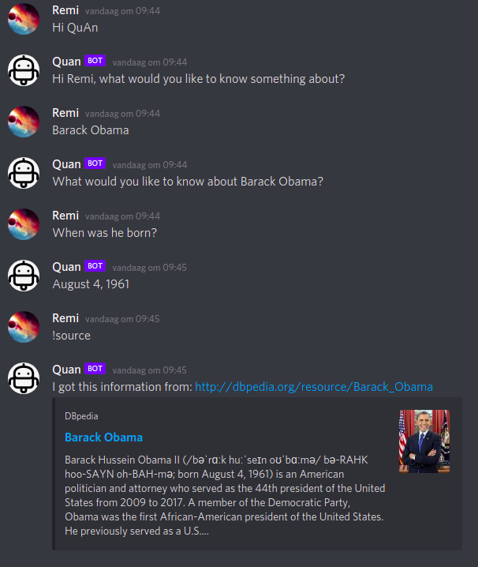

# QA-Discord-bot
This is a Discord bot that can answer question about the world around us. For questions or concerns please reach out to:

Remi Thüss - r.m.thuss@student.rug.nl

Robert van Timmeren - r.j.van.timmeren@student.rug.nl

<h2>Demo</h2>

<b>On request</b> a bot can be made available on: https://dbpediabot.remithuss.com/. Please use one of the provided emailadresses to request the bot to be made available. Note that due to restrictions by discord it is unfortunately not possible to run a version of this bot for yourself.

<h2>How it works</h2>

Commands:
<ul>
  <li><b>Hi QuAn</b> (to activate the bot)</li>
  <li><b>!source</b> (to retrieve the source of the last answered question)</li>
</ul>

<h2>Example</h2>

<h2>Performance</h2>
As this bot requires a topic to work from, tradditional benchmarks such as SQuAD are difficult to compare with. To offer some form of comparrison however, 100 questions from the SQuAD and WikiQA dataset were given to the bot with a topic taken from the sentence or a previous question. The results can be found here:
https://docs.google.com/spreadsheets/d/1oUXumb7QTOv7W9T4CaBdWUzwMFyZQ3uGL4-BJrlpKpU/edit#gid=0
